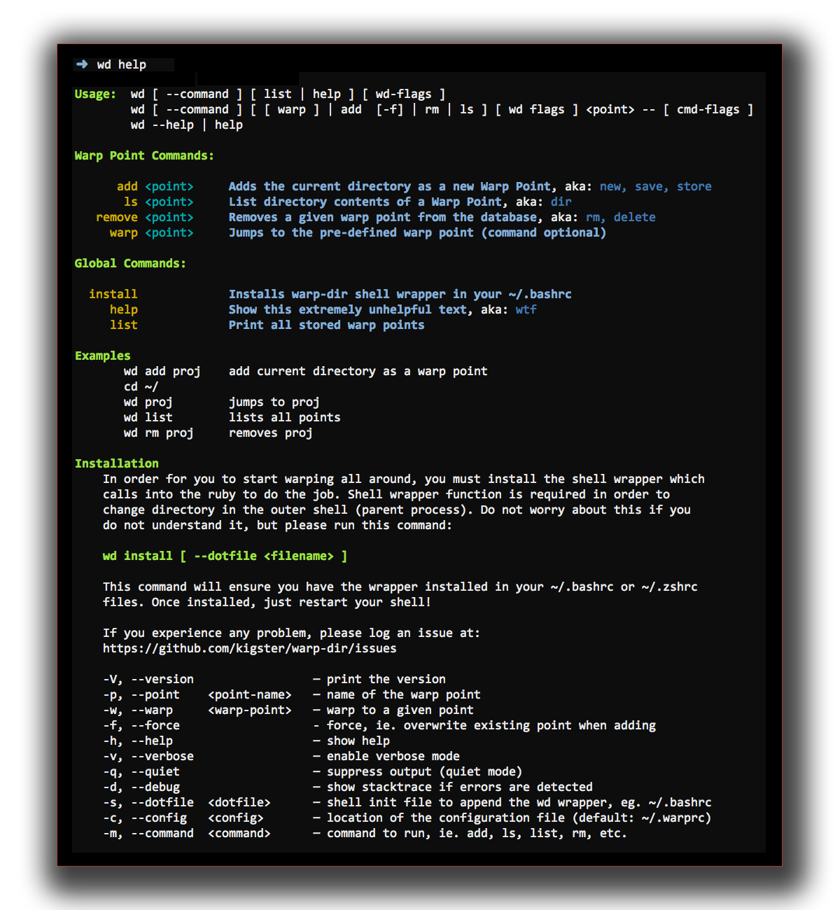

# Warp Directory

[](https://badge.fury.io/rb/warp-dir)
[](https://travis-ci.org/kigster/warp-dir)
[](https://codeclimate.com/github/kigster/warp-dir)
[](https://codeclimate.com/github/kigster/warp-dir/coverage)
[](https://codeclimate.com/github/kigster/warp-dir)

<hr/>
[](https://gitter.im/kigster/warp-dir)
<hr/>

This is a ruby implementation of the tool 'wd' (warp directory),
[originally written as a zsh module](https://github.com/mfaerevaag/wd)
by [Markus Færevaag](https://github.com/mfaerevaag).

After finding it very useful, but having to switch to `bash` on occasion, I wanted to have a completely
compatible tool that is well tested, and can be extended to do some more interesting things.

Markus kindly offered a ruby version in a [separate branch of this module](https://github.com/mfaerevaag/wd/tree/ruby),
which served as an inspiration for this gem.

The overall concept comes from the realization that when we work on the command line, we

 * often have to deal with a limited number of folders at any given time
 * it would be nice to quickly switch between these folders (which we call __warp points__).
 * it should be easy to add, remove, list, and validate warp points
 * everything should require as few characters as possible :)

Some future extensions could be based on some additional realizations:

 * each folder often represents a project, some of which are managed by `git`
 * eventually we might want to do things across all projects, such as perform group `git pull`,
   or even `git push` etc.

## Installation

Add this line to your application's Gemfile:

```ruby
gem 'warp-dir'
```
And then execute:

    $ bundle

Or install it yourself as:

    $ gem install warp-dir --no-ri --no-rdoc

The last step is to install the `wd` bash function, which enables the `cd`-like behavior.
Choose 
    $ warp-dir install [ --dotfile <file> ]

And after that you need to restart your shell, and then you should get the command's
"help" message by typing:

    $ wd help

If the above command returns a properly formatted help like the image below, your setup
is now complete!

## Usage

The usage of the tool is derived from `ZSH`-based inspiration. If it ain't broke, don't fix it!
I like how `wd` can be used with very short warp points, so it's so much less typing. I often name
my points `pu` so that I can jump there with `wd pu`.

Unlike ZSH counterpart, this tool includes full command line parsing, so
you can (if you want to) use flags to achieve the same effect with more
characters to type, for example all below commands do the same thing.

```bash
  wd pu
  wd --warp --point pu
  wd -m warp -p pu
```

You can run a comman in the target directory without leaving the current via
`wd ls pu`, but in this implementation you can also pass arguments to `ls` after
the `--` in argument list, for example, to run `ls -1` I would do `wd ls pu -- -1`.

Here is a full command / help summary.



#### Notable Differences

 * instead of `wd add!` use `wd add -f <point>` (or --force)

These features will be added shortly:

 * for now `wd clean` is not supported
 * for now history is not supported
 * for now '-' is not supported

## Future Development

I have so many cool ideas about where this can go, that I created a
[dedicated page](ROADMAP.md) for the discussion of future features.  Please head over
there if you'ld like to participate.

## Development

After checking out the repo, run `bin/setup` to install dependencies.
You can also run `bin/console` for an interactive prompt that will
allow you to experiment.

To install this gem onto your local machine, run `bundle exec rake install`.
To release a new version, update the version number in `version.rb`, and
then run `bundle exec rake release`, which will create a git tag for the
version, push git commits and tags, and push the `.gem` file
to [rubygems.org](https://rubygems.org).

## Adding New Commands

Just follow the patter in the `lib/warp/dir/commands/` folder, copy and modify
one of the existing commands.  Command class name is used as an actual command.

## Contributing

Bug reports and pull requests are welcome on GitHub at https://github.com/kigster/warp-dir.

## Author

<p>&copy; 2016 Konstantin Gredeskoul, all rights reserved.</p>

## License

This project is distributed under the [MIT License](https://raw.githubusercontent.com/kigster/warp-dir/master/LICENSE).
